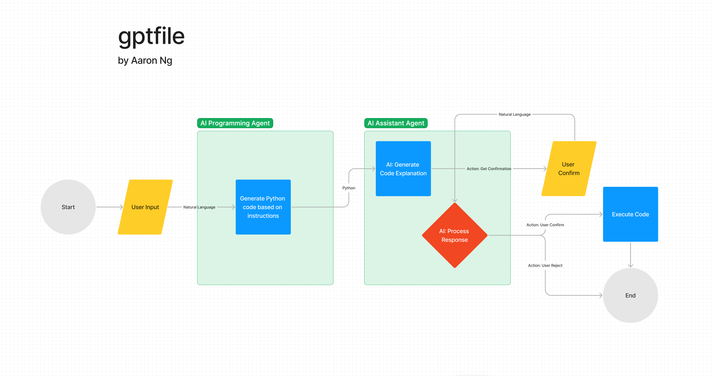

# gptfile

## About

A proof-of-concept infinite file-processing script using GPT-4. This illustrates GPT-4's ability
to manipulate your file system in one directory, but consider a future operating system that has no
"directory / file" prescription. Files are just sorted and presented in whatever form you 
need them, whether that's based on relevance to your task, the contents, or so-on.

Pull requests welcome.

## Flow

This works by.

1. Taking user input.
2. Using a programming agent to generate code.
3. Using an assistant agent that generates JSON to explain the code and process user input.
4. Executing the code once the user confirms.

## Usage

1. `poetry install` & `poetry shell`
2. Set your `OPENAI_API_KEY`.
3. It will run in your current working directory. Eg: `cd testfiles` & `python ../gptfile.py`

## Improvements

Future improvements could validate the code with an agent, allow further chained manipulation, or
allow the system to spin up a virtualenv with required packages for things like computer vision, 
before processing the files and destroying the virtual environment. 

Some additional considerations:
1. The completions occasionally do not work consistently. This could be improved with a validating agent.
2. The completions are very slow.
3. Input would ideally be looped, to allow iteration instead of only confirm / decline.

## Disclaimer

You assume all liability for running this, it might destroy your computer.

## Author

Aaron Ng ([@localghost](https://twitter.com/localghost))